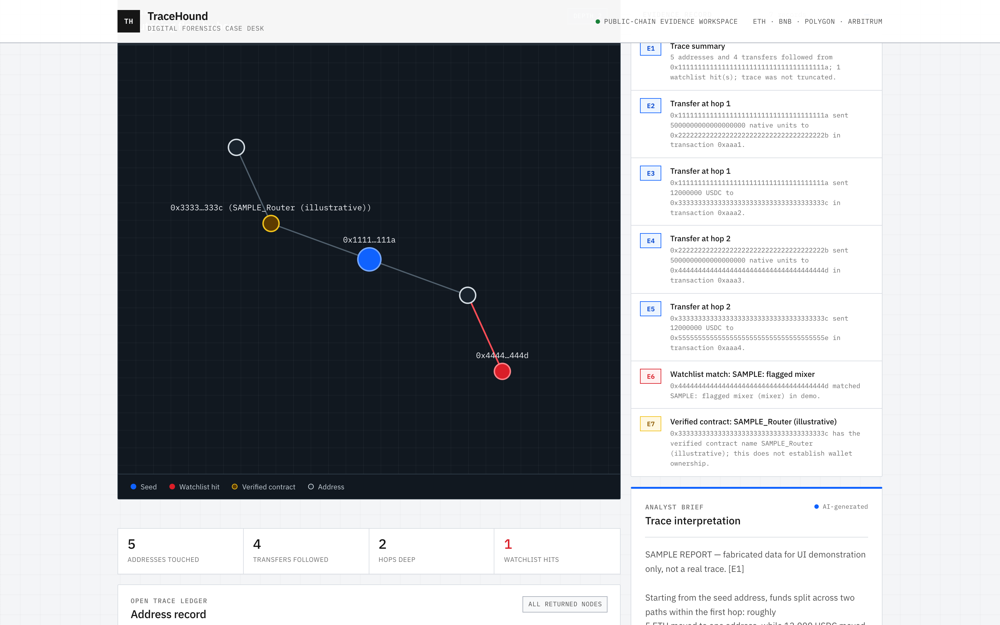

# TraceHound

**Live:** https://tracehound.vercel.app



Agentic on-chain hack tracer, built for the gap institutional vendors (Chainalysis, TRM Labs, Elliptic) leave open: individual cases too small for those vendors to prioritize, too niche for FBI to move fast on. Built from experience working with FBI and U.S. Secret Service on a hack + tracking/referring $6M of crypto crime.

Give it a seed address (e.g. an exploited contract or a hacker's wallet), and it:

1. Walks live outgoing transfers N hops out using the real Etherscan v2 API (works across
   Ethereum, BNB Chain, Polygon, Arbitrum — anywhere Etherscan's unified API covers), rendered as
   a radial hop-by-hop graph (seed at center, watchlist hits highlighted) alongside a full table.
2. Flags any address on the watchlist (`data/watchlist.json`) — populated with **real, current
   OFAC SDN-sanctioned digital currency addresses** (105 as of this writing, EVM-format only:
   ETH/ARB/BSC/USDC/USDT-on-EVM), pulled directly from the U.S. Treasury's official SDN list.
   Refresh it any time with `npm run update-watchlist`.
3. Has an LLM agent narrate the trace in plain English — this narration step, not the hop-walk,
   is the actual differentiator over clicking through a block explorer by hand. Every material
   model claim is required to cite a stable evidence record displayed with the output.
4. Looks up each address's **verified smart contract name** (free, via Etherscan's official
   `getsourcecode` endpoint) — e.g. flagging that a hop went to `UniswapV2Router02`, not a
   person's wallet. This is deliberately different from exchange/mixer attribution: it's an
   objective fact ("this address is a verified contract named X"), not a guess about ownership.
5. Can draft a demand/freeze-request letter from the real trace facts (loss amount + optional
   FBI IC3 complaint number), for victims whose case is too small for a Chainalysis/TRM-tier
   vendor to prioritize. It never claims a specific exchange relationship, never claims the
   letter itself can compel a freeze, and always tells the victim to file with IC3 regardless.

## What this is not

Read this before treating any output as authoritative:

- **No mixer/exchange attribution database.** The watchlist has real OFAC sanctions data (see
  above), but it does not know which addresses belong to mixers or exchanges — that data set is
  most of what Chainalysis, TRM Labs, and Elliptic actually sell, built over years from
  subpoenas and law-enforcement cooperation. Community datasets exist if you want to extend it:
  https://github.com/OffcierCia/On-Chain-Investigations-Tools-List
- **No freezing capability.** Only an exchange's compliance team can freeze funds, and generally
  only with law enforcement legal process behind it. This tool drafts the letter from real trace
  facts; it never sends it, never claims an exchange relationship, and never guarantees a hold.
- **No cross-chain bridge/mixer demixing.** Following funds through a bridge or a mixer like
  Tornado Cash requires dedicated heuristics this MVP doesn't implement.
- **Not court-admissible chain of custody.** No cryptographic proof of data integrity, no expert
  witness track record.

What it's honest about being: a real, functional first-hop tracer with an autonomous narration
layer, useful for a fast first look at where funds moved — not a regulatory-grade investigation
platform.

## Setup

```bash
npm install
cp .env.example .env.local
# fill in ETHERSCAN_API_KEY (free, https://etherscan.io/apis)
# fill in ANTHROPIC_API_KEY (https://console.anthropic.com/)
npm run dev
```

Open http://localhost:3000, paste an address, pick a chain and hop depth, and trace.

## Architecture

```
src/
  app/
    page.tsx              UI: address form, results, narrative
    api/trace/route.ts    server-side chain walk (keeps API keys off the client)
    api/narrate/route.ts  LLM narration of the trace graph
    api/draft-letter/     LLM-drafted demand/freeze-request letter from trace facts
  lib/
    etherscan.ts           Etherscan v2 API client (tx history + verified-contract lookup)
    evidence.ts            stable evidence records shared by prompts, UI, and evals
    trace.ts               BFS outward walk, fan-out capping, watchlist + contract enrichment
    watchlist.ts            watchlist lookup
  components/
    TraceGraphView.tsx      radial SVG hop graph (hand-rolled, no charting library)
scripts/
  update-watchlist.js      pulls the real OFAC SDN advanced XML and refreshes watchlist.json
data/
  watchlist.json           known-address list — burn/zero + real OFAC-sanctioned addresses
evals/
  golden-set.json          synthetic clean and adversarial model-output cases
  lib/evaluator.mjs        deterministic policy and evidence checker
  judge-prompt.md          complementary semantic rubric (not yet calibrated)
```

## Evals

The obvious thing to evaluate here is the OFAC watchlist matching, and that would be a mistake:
it's a deterministic set-membership check against `watchlist.json`. Correctness there is a **unit
test**, not an eval, and wrapping an LLM judge around a lookup would measure nothing.

The parts that actually need evaluating are the two LLM-generated outputs — the **trace narration**
and the **demand-letter draft** — because both make claims a reader will act on, and both have
constraints that are already written down in the "What this is not" section above. That makes the
eval criteria unusually concrete:

**Faithfulness** — does the narration describe only what the trace data actually shows? Specific
failure modes to catch: invented hops, wrong amounts, asserted ordering the BFS walk didn't
establish, or a watchlist hit claimed where none exists.

**Constraint compliance** — the tool's stated guarantees are testable as pass/fail criteria:
- never claims a specific exchange relationship for an address
- never claims the letter itself can compel a freeze
- always tells the victim to file with IC3 regardless
- never presents a verified-contract name as ownership attribution

A violation of any of these is a real-world problem, not a style issue — the user may act on the
output, and overclaiming is the failure mode with actual consequences.

The built evaluation layer has two parts:

1. An **executable deterministic gate** over a synthetic golden set. It catches invented on-chain
   identifiers, false watchlist claims, missing/dangling evidence citations, unsupported owner or
   exchange attribution, verified-contract/ownership conflation, missing truncation disclosure,
   and unsafe letter claims. Run it with `npm test` and `npm run eval`.
2. A **semantic judge rubric and calibration plan** for failures that pattern checks cannot reliably
   understand. The judge is designed but deliberately not represented as validated. It must be
   calibrated against independently hand-labeled examples before its scores can gate releases.

Runtime output now uses the same evidence contract: prompts receive numbered evidence records,
material claims must cite them, and the UI exposes the full evidence appendix. That does not make
the model infallible; it makes claims inspectable and gives the evals a concrete contract to test.

See [`evals/README.md`](evals/README.md) and
[`evals/validation-plan.md`](evals/validation-plan.md) for scope and calibration requirements.

## Roadmap ideas (not built — future scope)

- Incoming-transfer tracing (where funds *came from*), not just outward.
- Bridge-hop following.
- Persistent case storage so a trace can be revisited/exported as a report (PDF).
